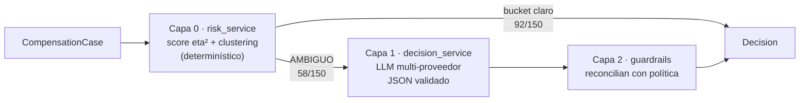

# Caso 03 — Automatización de Revisión de Compensaciones

Agente que clasifica solicitudes de compensación como **APROBAR / RECHAZAR / ESCALAR** con
justificación auditable, para reemplazar una revisión manual de 15-25 min por segundos.

> **Stack:** Python 3.10 · scikit-learn · LLM multi-proveedor (Groq/Gemini/OpenRouter) · FastAPI · FastMCP · web estática

**Demo:** https://cataia-code.github.io/rappi-technical-challenge-case03/
(clustering real corriendo en el navegador; casos ambiguos llaman a un LLM real vía Cloudflare Worker — pestaña **Demo**)

## Idea central

Los datos deciden lo claro; el LLM decide lo ambiguo. Un modelo de riesgo derivado de los
datos (Capa 0) resuelve el 61% de los casos (92/150) de forma determinística. Solo los
casos donde score y clustering discrepan (AMBIGUO) se enrutan a un LLM que lee el texto
del reclamo.

## Arquitectura



- **Capa 0 — `risk_service`**: score 0-1 ponderado por el poder discriminante real (eta²)
  de cada señal + `AgglomerativeClustering(k=3)` sobre la matriz numérica estandarizada
  (ganador de una comparación de 4 algoritmos × 2 matrices × barrido de k/eps, ver
  `docs/evaluacion_modelo.md`). Score y cluster discrepan → AMBIGUO.
- **Capa 1 — `decision_service`**: LLM multi-proveedor (fallback Groq→Gemini→OpenRouter),
  prompt versionado, salida validada con Pydantic. Solo se invoca en ambiguos; el texto del
  reclamo se trata como dato no confiable, nunca fuente única de verdad. Si el LLM falla o
  no valida → fallback conservador a ESCALAR.
- **Capa 2 — guardrails** (`feature_service`): acotan la salida del LLM a la política
  (FRAUDE no se auto-aprueba, LEGÍTIMO no se rechaza sin contradicción de GPS). Override
  auditable por caso en `override_guardrail`.

Detalle completo — criterios de decisión, manejo de ambigüedad, métricas de evaluación,
diagramas de secuencia/árbol de decisión — en `docs/politicas_decision.md`,
`docs/arquitectura.md` y `docs/evaluacion_modelo.md` (también navegables en la web).

## Manejo de ambigüedad

- **Detección:** condición matemática explícita, no "el LLM no supo" — AMBIGUO cuando el
  score de riesgo y el cluster asignado no coinciden.
- **Fallback si el LLM falla:** ESCALAR siempre, nunca se adivina un veredicto binario.
- **Última barrera:** guardrails de Capa 2 pueden degradar incluso una respuesta del LLM
  ya validada por esquema, si contradice la política.

## Web (`docs/index.html`, GitHub Pages, un solo archivo autocontenido)

6 pestañas: **Exploración** (hallazgos de datos) · **Modelo & Métricas** (52 combinaciones
probadas, pesos eta² reales, matrices de entrenamiento, PCA por bucket) · **Arquitectura**
(diagramas Mermaid interactivos + métricas del LLM) · **Escalamiento** (propuesta de agente
multimodal, diseñada no implementada) · **Dashboard** (150 casos filtrables) · **Demo**
(modelo de riesgo corriendo en JS + LLM real vía Worker).

## Organización del repo

```text
src/              Dominio, features, scoring, LLM, servicios y pipeline.
apps/web/         Template, builder y assets de la web.
apps/mcp/         Servidor FastMCP.
apps/api/         Superficie FastAPI.
experiments/      Selección de modelo y evaluación manual, reproducibles.
data/             raw/processed/labels versionados; output/ se genera localmente.
docs/             Web publicada (index.html) + documentación técnica.
tests/            Unit + integración del pipeline.
```

## Cómo correr en local

```powershell
# 1. Entorno (Python 3.10)
py -3.10 -m venv .venv
.\.venv\Scripts\python.exe -m pip install -r requirements.txt

# 2. Credenciales: copiar config\env.example -> .env (GROQ_API_KEY, GEMINI_API_KEY,
#    OPENROUTER_API_KEY). --no-llm no consume tokens.
$env:PYTHONPATH="src"

# 3. Correr el agente sobre los 150 casos -> data/output/salida_150.xlsx
.\.venv\Scripts\python.exe -m pipeline --no-llm             # sin tokens, entrega completa
.\.venv\Scripts\python.exe -m pipeline --workers 1          # con LLM en ambiguos
.\.venv\Scripts\python.exe -m pipeline --limit 15 --no-llm  # subconjunto rápido

# 4. Web estática
.\.venv\Scripts\python.exe apps\web\build_page.py            # -> docs\index.html

# 5. (Opcional) MCP / API HTTP
.\.venv\Scripts\python.exe apps\mcp\server.py
.\.venv\Scripts\uvicorn.exe apps.api.main:app --reload

# 6. (Opcional) Reproducir la selección de modelo
.\.venv\Scripts\python.exe experiments\scoring\model_selection.py
.\.venv\Scripts\python.exe -m scoring.train_risk_model

# Tests (falla si coverage < 80%, ver pyproject.toml + CI)
.\.venv\Scripts\python.exe -m pytest -q
```

> **Rate limit:** el free tier de Groq topa en 12k tokens/min y 100k/día. El ruteo
> selectivo (solo los 58 ambiguos van al LLM) mantiene un run completo dentro de ese
> presupuesto (~5 min). `--no-llm` genera el Excel completo sin gastar tokens
> (ambiguos → ESCALAR); si Groq falla a mitad de un run, el caso cae a ESCALAR
> conservando `risk_bucket`, `risk_score` y señales.

## Output

`data/output/salida_150.xlsx` — hoja **Casos** (`recomendacion_agente`, `risk_bucket`,
`risk_score`, `senales_dominantes`, `resumen_cs`, `razonamiento`, `override_guardrail`,
`modelo_usado`, `pasos_recomendados` para escalados) + hoja **Resumen**.

Reparto en modo `--no-llm`: **APROBAR 62 (41.3%) · RECHAZAR 30 (20.0%) · ESCALAR 58
(38.7%)**. Con LLM disponible, parte de los ambiguos se resuelve por texto y ESCALAR baja.

## Decisiones de diseño

- **Híbrido score + clustering, no LLM-para-todo:** los datos tienen un eje de abuso claro;
  el LLM se reserva para donde aporta — el texto de los casos ambiguos.
- **Sesgo FP>FN:** rechazar a un legítimo cuesta más que aprobar un fraude puntual acotado
  → RECHAZAR conservador, la incertidumbre va a ESCALAR.
- **Fronteras de servicio, en-proceso:** `apps/api` y `apps/mcp` son adaptadores delgados
  sobre el mismo `DecisionService`, sin base de datos ni cola para 150-200 filas/día.
- **Prompts versionados:** `llm/prompts.py::PROMPT_VERSION` viaja con cada ejecución.
- **La demo en vivo corre el modelo real en JS**, no una simulación: port 1:1 de
  `risk_service.py` verificado con test de paridad (`tests/test_scoring_js_parity.py`).
