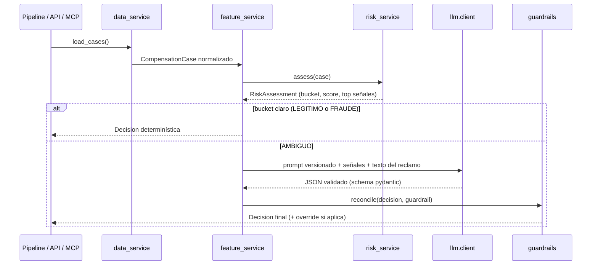
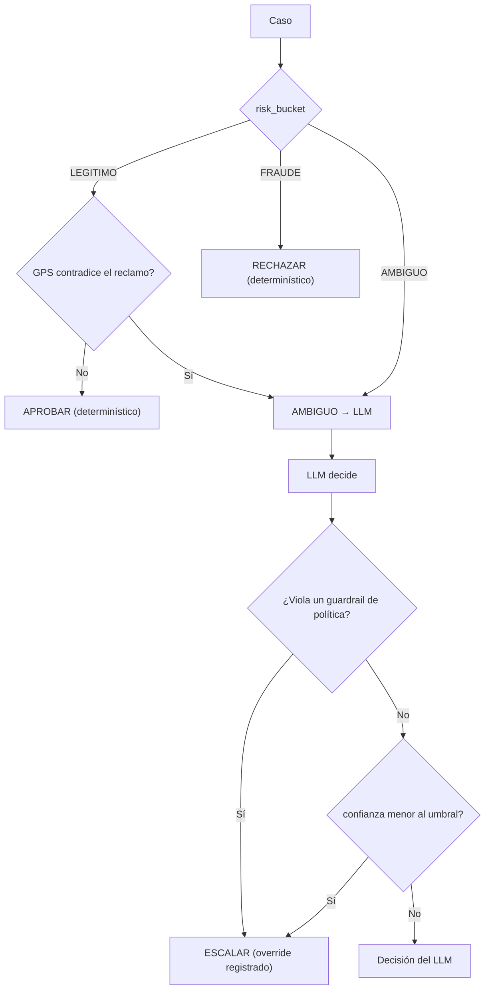
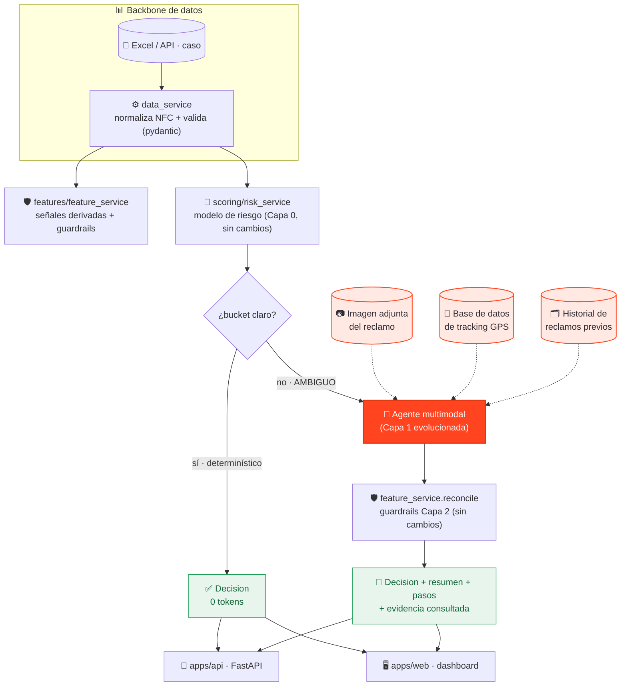
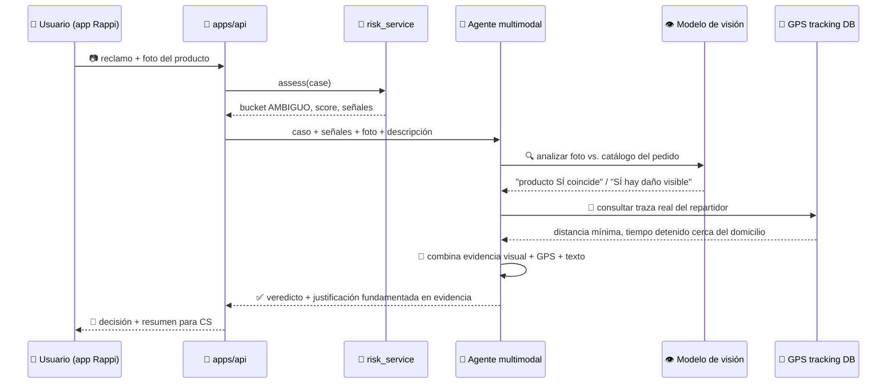
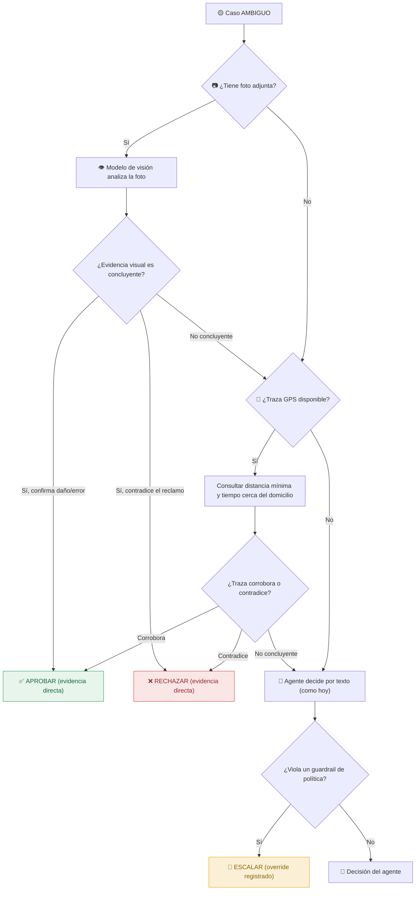
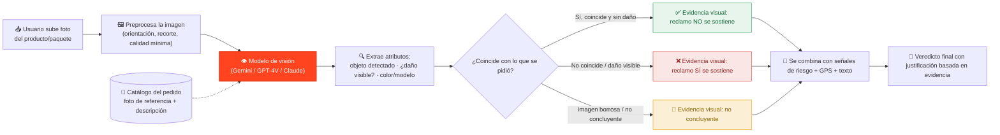

# Arquitectura — Caso 03

> Espejo en texto de las pestañas **Arquitectura** y **Escalamiento** del dashboard
> (`apps/web/templates/dashboard.html`). Los diagramas viven como definiciones Mermaid inline en ese
> archivo (`const DIAGRAMS`) y se renderizan en un modal con zoom y descarga; acá están en Mermaid
> puro para revisarlos sin abrir la web.

## Tres capas, con un backbone de datos

```
                 ┌─ Capa 0 · risk_service ─ modelo de riesgo (score + clustering)   [determinístico]
CompensationCase ┤
                 ├─ ¿bucket claro? → decisión determinística (92/150, sin LLM)
                 └─ ¿ambiguo?      → Capa 1 · llm/client (multi-proveedor, JSON validado)
                                     → Capa 2 · feature_service.reconcile (guardrails)
                                     → Decision (recomendación + resumen + señales + pasos)
```

- **Capa 0 — `scoring/risk_service`**: score de riesgo 0–1 ponderado por el poder discriminante real
  (eta²) de cada señal + clustering (modelo ganador: Agglomerative k=3, ver
  `data/processed/model_selection.json`). Si score y clúster coinciden → bucket; si discrepan →
  AMBIGUO. 100% determinístico y auditable. Entrenar: `python -m scoring.train_risk_model`
  (ejecutar con `PYTHONPATH=src`).
- **Capa 1 — `llm/client` + `llm/prompts`**: LLM multi-proveedor (Groq → Gemini → OpenRouter, en ese
  orden de fallback) con salida JSON validada (`llm/schemas.py`). Solo se invoca en casos ambiguos;
  el texto del reclamo se trata como dato no confiable (defensa contra inyección de prompt).
- **Capa 2 — `features/feature_service` (guardrails)**: acota la salida del LLM a la política
  (FRAUDE no puede auto-aprobarse; LEGÍTIMO no puede rechazarse sin contradicción de GPS; ante duda,
  ESCALAR). Nunca hay un RECHAZAR determinístico por reglas solas — el sesgo es FP&gt;FN.

## Dónde vive cada pieza

| Componente | Módulo | Rol |
|---|---|---|
| Backbone de datos | `services/data_service.py` | Único punto que sabe leer el Excel; normaliza NFC y valida con Pydantic (`domain/models.py`) |
| Normalización de categóricas | `experiments/scoring/model_selection.py` | One-hot de `vertical`/`motivo_reclamo`/`entrega_confirmada_gps` para la comparación de modelos |
| Modelo de riesgo | `scoring/risk_service.py` + `scoring/artifacts/risk_model.json` | Inferencia con solo numpy, sin sklearn en producción |
| LLM | `llm/client.py`, `llm/prompts.py`, `llm/schemas.py` | Cliente OpenAI-compatible (Groq/Gemini/OpenRouter), prompt versionado, schema Pydantic |
| Orquestador | `services/decision_service.py` | Fast-path determinístico + LLM + guardrails |
| Batch | `pipeline.py` | Corre los 150 casos → `data/output/salida_150.xlsx` |
| API | `apps/api/main.py` (FastAPI) | `POST /decisions`, `POST /cases/{id}/decisions`, `GET /health` |
| MCP | `apps/mcp/server.py` (FastMCP) | Tools `review_case` / `review_payload` |
| Web | `apps/web/build_page.py` + `apps/web/templates/dashboard.html` | Genera `docs/index.html` (GitHub Pages) |
| Worker LLM | `apps/web/worker/index.js` | Proxy público para la demo: `GET /health`, `POST /` para casos ambiguos; CORS restringido a GitHub Pages |

## Diagrama de secuencia



## Árbol de decisión



---

## Evolución propuesta: escalar a un agente multimodal, no a un LLM de texto

**Estado: diseño propuesto, todavía no implementado.** Hoy la Capa 1 recibe únicamente texto
(bucket, score, señales dominantes y `descripcion_reclamo`). Eso resuelve la mayoría de los casos
ambiguos, pero tiene un techo: un reclamo de "producto dañado" o "me enviaron otra cosa" es mucho
más fácil de verificar con una foto que con una frase, y el flag de GPS hoy es un estado agregado
(confirmada / no confirmada / parcial / señal perdida) — no la traza real del repartidor.

La propuesta evoluciona la Capa 1 de "LLM que lee un resumen de texto" a un **agente multimodal**
que puede consultar evidencia real antes de decidir, sin tocar Capa 0 (el modelo de riesgo sigue
siendo el mismo backbone determinístico) ni Capa 2 (los guardrails siguen acotando la salida igual):

- **Visión sobre la imagen del usuario**: si el reclamo incluye una foto, un modelo con visión
  (Gemini / GPT-4V / Claude) la analiza y contrasta contra el catálogo del pedido.
- **Traza real de GPS**: consulta la base de datos de tracking del repartidor — distancia mínima
  alcanzada al domicilio, tiempo detenido cerca de la dirección — en vez del flag agregado.
- **Historial ampliado**: reclamos previos del mismo usuario con foto adjunta, conversaciones de
  soporte anteriores.

Por qué esto reduce aún más el escalamiento a humano: hoy, un caso con relato plausible pero sin
forma de verificarlo objetivamente tiende a ESCALAR (ante la duda, no se fuerza un binario). Con
evidencia visual y de tracking real, una parte de esos casos deja de ser ambigua — la foto o la
traza GPS los resuelve directamente, y el humano solo ve lo que sigue siendo genuinamente incierto
incluso con más evidencia.

### Arquitectura evolucionada



### Secuencia — caso ambiguo con foto adjunta



### Árbol de decisión evolucionado



### Cómo el agente analiza una imagen del reclamo



### Qué falta para implementarlo

- Elegir un proveedor de visión (Gemini, GPT-4V, Claude) y sumarlo a `llm/client.py`.
- Definir el contrato de subida de imagen en el formulario de reclamo (tamaño, formatos, dónde se
  almacena).
- Exponer un endpoint de lectura sobre la base de datos de tracking GPS real (hoy solo existe el
  flag agregado en `entrega_confirmada_gps`).
- Extender `domain/models.py` / `llm/schemas.py` para que la `Decision` registre qué evidencia
  (imagen, traza GPS) se consultó y qué concluyó, no solo el veredicto final.
